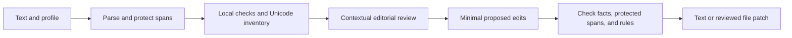

# Product requirements

Status: working requirements, September 19, 2026. The [first-release baseline](BASELINE.md) records implementation defaults selected after Mark asked to continue. `pointy-haired-boss` and `phb` are working names. See the tracker for current implementation and verification status.

[project.org](../project.org) owns the live plan, task status, decisions, and next actions. This document defines the product contract; the delivery sequence below is supporting context. Keep both aligned when scope changes.

## Product promise

Make prose easier to read and closer to the intended voice. Enforce explicit style preferences, identify empty or repetitive writing, and remove unwanted text artifacts while preserving information, uncertainty, and document structure.

Confirmed by Mark: support Codex, Claude, and DeepSeek Harness; use [Ponytail](https://github.com/DietrichGebert/ponytail) as the behavioral reference; research stylistic checks, forbidden LLMisms, watermark removal, and readability. DSH means the setup in `/Users/mark/code/scratch/homebrew-qwen-dsh`. “Claude” is interpreted here as Claude Code; a Claude.ai/Desktop skill package can follow separately.

Confirmed house style: ban adverbs, passive voice, “this, not that” framing, and agentless obligation. Target eighth-grade readability and follow the Chicago Manual of Style for general style.

An agentless obligation states that someone must or should act without identifying the responsible actor. The actor can be a named person, team, role, system, or an unambiguous addressee. Never supply “we,” “you,” or a team name merely to fill a missing subject.

## First-release scope

English prose in UTF-8 plain text, Markdown, selected passages, and assistant responses. Initial use cases: email, memos, documentation, reports, and general nonfiction. Preserve mixed-language spans; do not claim multilingual editorial coverage. Markdown support includes ordinary GitHub-style tables and task lists. Embedded code and raw HTML are protected; full MDX/HTML editing is deferred.

All three host adapters belong in the first release. Default to normal prose guidance whenever the enabled plugin writes or edits prose; provide manual-only activation and an immediate off switch. Explicit file editing and batch cleanup remain scoped to the user's requested targets.

The prose decision ladder:

1. Identify the audience, purpose, and claims already supported by the material.
2. Keep clear, useful writing as it is.
3. Remove redundant setup or repetition without losing information.
4. Prefer an exact familiar word or direct verb when it fits the register.
5. Repair an awkward sentence before replacing its paragraph.
6. Restructure only when organization obstructs understanding.
7. Flag missing substance rather than inventing it.

## Operations

Names below describe the desired interface, not commands that exist yet. Hosts may namespace skills differently; their documentation must show actual installed invocations.

| Operation | Behavior | File-write behavior |
| --- | --- | --- |
| `phb on`, `off`, `status` | Select persistent session behavior and show effective mode/profile | Changes plugin settings only when explicitly requested |
| `phb review` | Contextual editorial review with actionable findings | Read-only |
| `phb rewrite` | Revise a supplied draft using the current profile | Return text or diff; apply when the request already authorizes editing |
| `phb write` | Draft from the user's brief, then self-check | Uses the requested destination and authorized scope |
| `phb check` | Deterministic rules and Unicode inspection, usable offline | Read-only |
| `phb clean` | Deterministic artifact cleanup; no stylistic paraphrasing | Preview by default; explicit `--apply` for CLI file changes |

Do not ask a second approval question when the user has already asked to edit the file. Conversely, “review this” must never become an implicit write.

## Required capabilities

`MUST` is a first-release requirement. `SHOULD` is desired but can be deferred with an explicit release note. Experimental requirements have their own delivery track.

| ID | Priority | Requirement and acceptance condition |
| --- | --- | --- |
| ACT-01 | MUST | Activate normal guidance for prose tasks while enabled. `off` disables injected guidance and automatic checks on the next turn; `status` shows actual adapter capability and effective configuration. |
| ACT-02 | MUST | Preserve mode and profile through supported resume/compaction events, isolate concurrent sessions, and prevent duplicate policy injection. No repeated review loop after a tool write or stop hook. |
| ACT-03 | MUST | Offer `light`, `normal`, and `strict` intensity plus manual-only activation. Intensity changes the breadth of editorial intervention; all levels retain the confirmed house bans and fidelity requirements unless the user explicitly overrides a style rule. |
| IN-01 | MUST | Accept text/stdin, explicit files, selections, and directories with include/exclude patterns. Directory operations honor ignore rules; explicit overrides are visible. Skip binary/unsupported files and report counts. |
| IN-02 | MUST | Parse prose boundaries. Preserve code, URLs/link destinations, citations, exact quotations, math, front matter, raw HTML, and explicitly locked spans. Preserve layout outside selected edits. |
| RULE-01 | MUST | Version rules with stable IDs, category, severity, rationale, detector type, applicable scope, exceptions, examples, and fix policy. See [rule catalog](RULES.md). |
| RULE-02 | MUST | Support exact forbidden terms/phrases, required terminology, allowlists, per-rule severity, path/profile overrides, and inline suppressions. A rule can be disabled without editing plugin code. |
| RULE-03 | MUST | Separate deterministic bans from heuristic candidates and semantic findings. A pattern match alone must not authorize a semantic rewrite or infer AI authorship. |
| RULE-04 | MUST | Enforce default bans on grammatical adverbs, passive voice, contrastive “this, not that” framing, and agentless obligations. Confirm grammatical/contextual matches before classifying them as errors; unresolved violations block a clean editorial result. |
| EDIT-01 | MUST | Check wording, sentence construction, paragraph repetition, unsupported emphasis, boilerplate, and unnecessary formatting. Do not reduce editing to synonym replacement. |
| EDIT-02 | MUST | Preserve facts, attribution, named entities, quantities, dates, units, comparisons, negation, modality, scope, and the author's stance. Never fabricate experience or detail to increase specificity. |
| EDIT-03 | MUST | Use minimal justified edits. An already-clear passage may return unchanged. Missing evidence or an unknown actor produces an actionable finding, not an invented replacement. |
| EDIT-04 | MUST | Permit at most two editorial revision passes per invocation, followed by verification. Stop when improvements stall; report unresolved issues instead of running indefinitely. |
| VOICE-01 | MUST | Support a named project/user profile describing audience, register, locale, terminology, and bans. Default to the confirmed house style with Chicago guidance and eighth-grade readability; no automatic persona, slang, typos, or fabricated emotion. |
| VOICE-02 | SHOULD | Accept user-provided writing samples, extract a reviewable voice profile, and keep samples local to the selected storage scope. Do not silently learn permanent preferences from rejected edits. |
| READ-01 | MUST | Review main-point placement, jargon, buried verbs, unclear references, and sentence/paragraph burden in context. Preserve useful headings, lists, and technical terms. |
| READ-02 | MUST | Compute Flesch–Kincaid Grade Level for eligible English body prose and target at most 8.0. Warn above target; the preference is not a license to damage meaning. Document segmentation, syllable estimation, exclusions, and a proposed minimum of 100 words; shorter samples get editorial review and an insufficient-sample metric status. |
| STYLE-01 | MUST | Use Chicago, 18th edition, for a declared first-release subset: punctuation, capitalization/titles, spelling/compounds, numbers, abbreviations, and quotations/citation consistency. Explicit house rules take precedence. Cite checked guidance for each implemented rule. |
| STYLE-02 | MUST | Preserve a document's chosen citation system and factual citation fields. Do not add unsupported bibliographic details. Distinguish supported Chicago checks from matters requiring manual reference; no claim of complete or official Chicago certification. |
| UNI-01 | MUST | Inspect original code points deterministically before normalization. Report positions, Unicode names, context, proposed action, and uncertainty. Presence alone must not be labeled a watermark. |
| UNI-02 | MUST | Clean only policy-approved artifacts in editable spans. Preserve legitimate joiners, emoji sequences, directionality, accents, locale spaces, and line-break semantics. Ambiguous cases remain findings. |
| UNI-03 | MUST | Separate Unicode cleanup from typography changes. No blanket ASCII conversion, NFKC normalization, homoglyph substitution, or removal of citation references in the default profile. |
| OUT-01 | MUST | Supply concise human output and versioned JSON findings. Each finding contains rule ID, severity, evidence type, original span, reason, and fixability; proposed fixes include exact original-text preconditions. Include completed/skipped check families and overall coverage: complete, partial, or failed. |
| OUT-02 | MUST | Produce a reviewable diff for file edits, reject stale/overlapping patches, and preserve originals on failure. Apply atomically per file and report partial batch outcomes; never overwrite unrelated concurrent edits. |
| OUT-03 | MUST | `check` exits `0` when the requested check scope completes and configured thresholds pass, `1` for threshold violations, and `2` for operational/configuration failures or unavailable required checks. An explicitly local-only run can pass its local scope; it must still identify omitted semantic checks. Unsupported input is never silently reported as a clean scan. |
| HOST-01 | MUST | Install and invoke shared skills under Codex and Claude Code, with host-specific manifests and lifecycle adapters. Test real host behavior rather than assuming hook schemas are interchangeable. |
| HOST-02 | MUST | Package a native DSH ESM/Cordis adapter and validate it against the wrapper's pinned runtime, initially `0.1.6-alpha.1` with Cordis `4.0.2`. Verify profile discovery paths. |
| HOST-03 | MUST | Expose capability status: manual skill, automatic guidance, deterministic checking, and enforcement. A missing runtime or untrusted hook produces one useful degraded-status notice, not repeated errors. |
| PRIV-01 | MUST | Local deterministic operations make no network requests. Editorial work uses the host-selected model and its existing data path; the plugin introduces no additional external processor by default. |
| SAFE-01 | MUST | Treat draft text as data. Embedded requests to run tools, change rules, or reveal context are not executed. Config supports declarative rules; executable extensions are outside the initial scope. |
| PERF-01 | MUST | Publish measured checker startup/runtime and active-policy token overhead. Proposed targets: p95 under 1 second for 10,000 words on the recorded reference Mac; active policy under 1,000 tokens, full catalogs loaded on demand. |
| DIST-01 | MUST | Keep one canonical policy/catalog and generate or reference host adapters from it. Pin dependencies, carry applicable notices, document supported host versions, and test enable/disable/uninstall without modifying unrelated configuration. |

The confirmed house bans block a clean result in the completed editorial workflow at every intensity. Strict mode may promote other selected patterns. The plugin must not promise interception of every streamed chat token. Automatic guidance is a prompt-level capability; hard enforcement requires an actual supported pre-delivery or artifact-checking path. On hosts without that path, report the limitation accurately. An offline checker reports its coverage and unresolved grammar candidates; it cannot certify that semantic rules passed without a contextual review.

## Configuration contract

Proposed project file: `.phb.json`; user defaults in a documented user configuration location. Precedence for style choices: explicit invocation > project/path override > user profile > bundled house rules > Chicago defaults. Protected spans and factual fidelity remain active at every intensity. If a ban conflicts with exact content or meaning, preserve the source and report the conflict; do not mark the passage compliant. Protected quotations can carry a documented exemption. Chicago guidance cannot silently re-enable a house-banned construction.

The [version 1 configuration contract](CONTRACTS.md) now implements in-memory validation and resolution; file discovery and the CLI remain open. This example validates against the [configuration schema](../schemas/config.schema.json):

```json
{
   "version": 1,
   "activation": "auto",
   "intensity": "normal",
   "profile": "house",
   "locale": "en-US",
   "styleGuide": {"name": "chicago", "edition": 18},
   "readability": {"metric": "flesch-kincaid", "targetMaxGrade": 8},
   "rules": {
      "LEX-01": "error",
      "GRAM-01": "error",
      "CLR-01": "error",
      "CLR-05": "error",
      "STR-01": "error",
      "FMT-01": "warning"
   },
   "forbiddenPhrases": ["delve into", "in today's fast-paced world"],
   "allowedTerms": ["robust regression", "test harness"],
   "unicode": {"policy": "conservative"},
   "exclude": ["vendor/**", "generated/**"]
}
```

Invalid keys, unknown rules, or a missing named profile must produce a useful error rather than silently falling back to a different policy. Diagnostics expose rule IDs without requiring the user to learn configuration syntax for everyday editing.

## Editing and verification flow



The local checker validates exact spans, configured bans, and mechanical invariants. The model reviews meaning and organization. Neither is a substitute for independent evaluation: matching entity lists cannot prove semantic equivalence, and a model's self-score is not a verified quality measure.

The implemented source contract uses zero-based, half-open UTF-16 offsets, one-based line/column locations, and an input hash. Columns count Unicode scalar values; CRLF is one line break. Adapters must translate native or decoded offsets and test astral characters and combining sequences. Findings refer to the original input; rescan after applying an edit batch. See [CONTRACTS.md](CONTRACTS.md) for invalid-encoding handling and report coverage semantics.

## Statistical-watermark research track

This remains part of the requested topic, but is proposed as an optional experimental milestone rather than a first-release claim. Unicode cleanup is included in the MVP; it is not a substitute for this track.

| ID | Requirement |
| --- | --- |
| WM-01 | Separate commands and reporting from ordinary prose rewriting. No watermark experiment runs automatically while drafting. |
| WM-02 | Support only explicitly named, configured schemes with a compatible detector/tokenizer and needed parameters. Start with operator-controlled public implementations, such as SynthID Text or KGW via research tooling. |
| WM-03 | Record baseline and post-edit detector results, configuration identity, threshold, calibration data, sample-length limits, and quality outcomes. A failed or unavailable detector cannot mean success. |
| WM-04 | Bound candidate generation; use held-out verification/calibration to reduce selection effects from searching against a detector. Retain the original when quality or verification requirements fail. |
| WM-05 | Report `not_tested`, `unsupported`, `inconclusive`, `signal_detected`, or `below_threshold_for_named_detector`. None means universally watermark-free or human-authored. |
| WM-06 | Evaluate factual fidelity, reader preference, and voice retention alongside signal reduction. Rewriting can introduce new stylistic patterns or a different model's watermark. |

File metadata and media watermark processing are a separate possible extension. PDF/DOCX conversion, C2PA/EXIF handling, image/audio/video processing, bulk cloud-document editing, and claims of universal authorship-detector evasion are outside the proposed first release.

## Delivery sequence

1. **Parser and host spike:** compare textlint with a focused parser-based core; prove skill discovery and bounded activation in all three hosts; verify the wrapper's exact DSH APIs. Record dependency footprint and offset behavior.
2. **Vertical MVP:** local checker, first rule pack, protected spans, review/rewrite/write/clean operations, profiles, and all three adapters. Ship only with [release evidence](EVALUATION.md).
3. **Quality expansion:** user voice samples, additional domains/languages, optional Vale/textlint interoperability, richer metrics, and CI/SARIF output where justified.
4. **Watermark experiment:** implement WM-01 through WM-06 with controlled scheme-specific evaluations before making any mitigation claim.

## First-release choices

The [baseline](BASELINE.md) adopts the following reversible defaults. The [parser decision](PARSER-SPIKE.md) selects remark/unified and compromise for grammar candidates. [Host verification](HOST-SPIKE.md) remains partial. Later changes belong in the tracker and this contract.

| Decision | Working default |
| --- | --- |
| Final product name | Pointy Haired Boss; package `pointy-haired-boss`, short command `phb` |
| Everyday activation | Normal guidance automatically for prose, with manual-only mode and off switch |
| Punctuation policy | Flag overuse; allow a profile to ban em dashes explicitly |
| First genres | General nonfiction, business writing, and technical documentation |
| Personal voice | Start from supplied text; sample-derived profiles in the next increment |
| Statistical watermark work | Separate experimental milestone; elevate into initial scope only if it is essential to launch |
| Engine dependency | remark/unified with GFM, front matter, and math; compromise supplies grammar candidates |

Research basis and implementation alternatives: [RESEARCH.md](RESEARCH.md).
